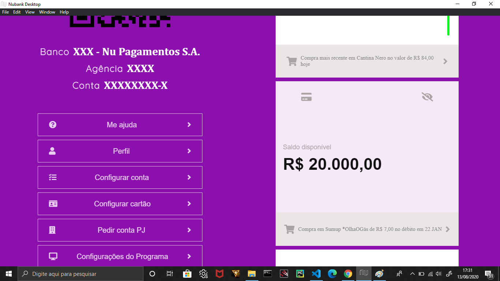

# Nubank Desktop

## Após alguns estudos sobre elétron, consegui gerar meu primeiro projeto solo, a versão desktop do aplicativo Nubank. Este projeto foca mais no front-end, por isso não tem uma dinâmica interessante, mas tenta ser fiel à estética do app.

## The following images demonstrate the final result.

## As already mentioned, this project focuses more on aesthetics. The next version will have more dynamics and the attempt to implement ReactJs + Typescript, in addition to being able to consume information from databases.